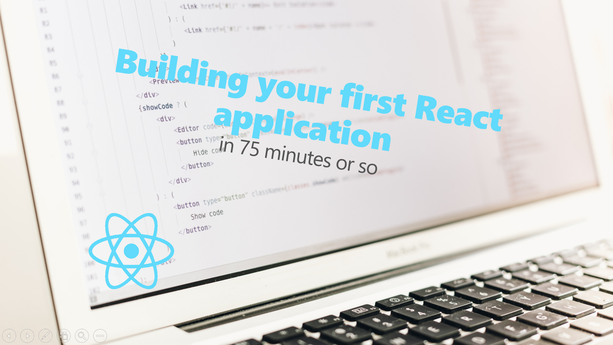

# Skillshare Top Movies

## [Building your first React application in 75 minutes or so](https://www.skillshare.com/classes/Building-your-first-React-application-in-75-minutes-or-so/1253484924/classroom/discussions)

In this course, you are going to learn how to build an application using React. First, you will learn why React is such an awesome library to build web applications. Then we are going to go over the basics of React. Then we will use this knowledge to build an application to see some of the top rated movies. Of course, we will make this a nice looking application and wrap up by deploying it to the web.

Based on the experience from this course you will be able to start creating your own React applications.

We are going to start from scratch so no prior React experience is required. I am assuming you are familiar with HTML, JavaScript 5 and CSS however. I will be using newer JavaScript syntax in places but I will explain these as we go along.

---

 

You can find the video course on SkillShare [here](https://www.skillshare.com/classes/Building-your-first-React-application-in-75-minutes-or-so/1253484924/classroom/discussions). Enjoy 😄